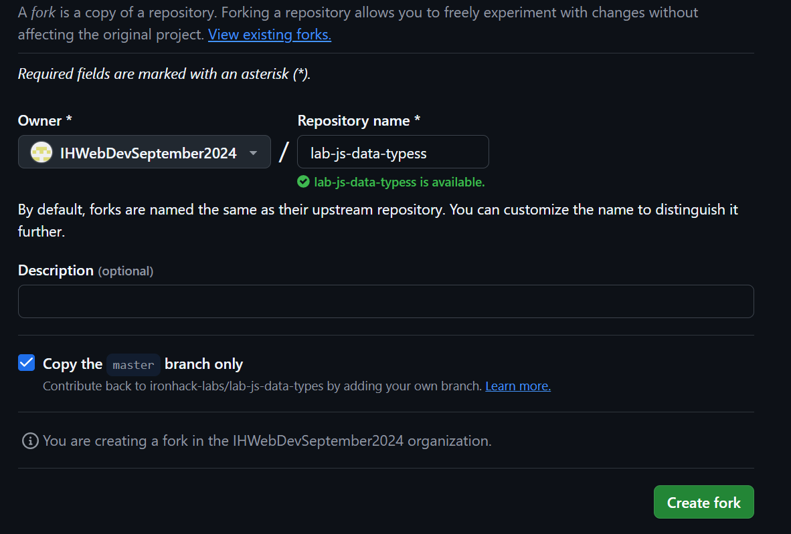
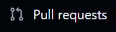
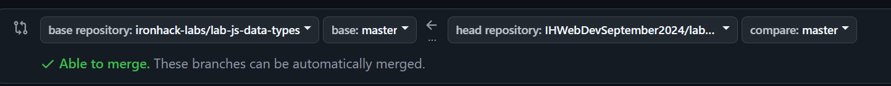

# Git cheat sheet for LABS

## Forking a repository

1. Go to the repository you want to fork
2. Click on the fork button on the top right corner of the page


3. Click on create fork




## Cloning a repository

1. Now that you have forked the repository, you can clone it to your local machine
2. Click on the green code button 


3. Copy the link


4. Open your terminal
5. Navigate to the directory where you want to clone the repository
6. Run the following command

```bash
git clone https://your-repository-link-pasted-here
```

## Adding and committing changes

1. Make the changes you want to make in the repository
2. Run the following command to add the changes

```bash
git add .
```

3. Run the following command to commit the changes

```bash
git commit -m "Your commit message"
```

4. Run the following command to push the changes to the repository

```bash
git push origin main
```
*note can be main or master depending on the branch name

## Creating a pull request

1. Go to the repository on your github account
2. Click on the pull request tab



3. Click on the new pull request button
4. Add a title and description to your pull request
5. Click on create pull request
7. Make sure you are comparing the correct branches, on the left should be the original repository and on the right should be your forked repository



6. Copy the pull request link and share it in the portal
